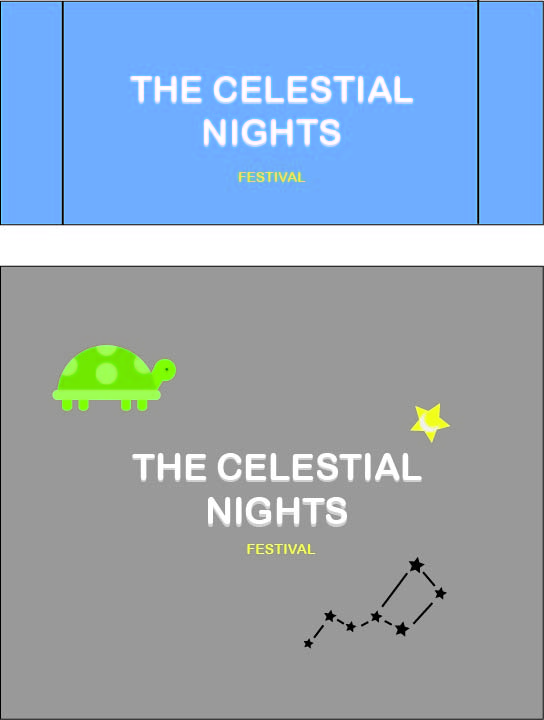
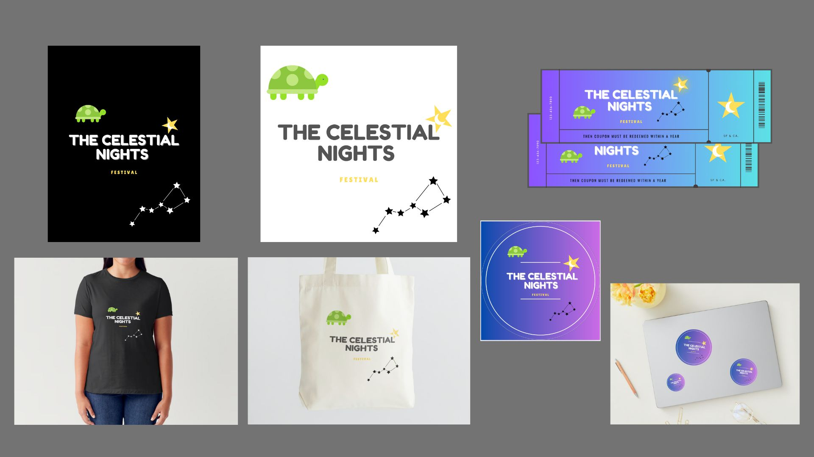

# Project 3: Festival Guide 

### December 2, 2024
By: Johnathan Martinez Pena

## Project Overview:

For this project, I dedicated my festival on light pollution, which is called "The Celestial Nights Fest, a three-day immersive event dedicated to celebrating natural darkness. From December 8-10, the festival will occur across prominent locations in and around San Francisco, such as Lake Tahoe, Twin Peaks, Mount Tamalpais, the Chabot Space and Science Center, and Lick Observatory. 

The festival features interactive art installations, expert talks, guided stargazing, nature walks, and a reflective candlelight procession, all designed to deepen public understanding and appreciation of the dark skies. 

Its mission is to raise awareness about light pollution and its detrimental effects on wildlife and human health while supporting the International Dark-Sky Association, an organization committed to reducing excess artificial lighting and protecting natural darkness as light pollution disrupts the behaviors of wildlife, such as turtles and birds, while also posing health risks to humans, and including sleep disturbances.

By having a simple layout across the website, it'll be easy for the users who come across the website to manage their way around it. These festivals target environmentalists, conservationists, educators, students, astronomers, and local community members, particularly those in urban areas where light pollution is most prevalent.  

## Figma Wireframe Link 

https://www.figma.com/proto/ti5OzDF2JQHGcaB8Sy5Ij0/Project-3%2F-Prototype-Wireframe?node-id=1-27&t=4CXwbScGOC7xvio7-1&starting-point-node-id=1%3A27

## Technical Overview:

- Incorporation of dark sky theme, with stars and elements that would relate to the topic on light pollution. 
- Skyscrapers, artificial lights, and the night sky in the background of the website to represent the problem, and to put a greater emphasis on the cause that is being addressed in this website. 
- Animated text that would lead to other pages upon hover. 
- Merchandise that would be disposable, and would promote the event/festival.

The coding languages I'm utilizing include: 
- HTML: To structure the website, by including text, and a navigation to the different pages included in the project. 
- CSS: To style the website, including color in text and in background, fonts, layout of the website, transformations, and effects. 

I am using GitHub as the platform for hosting and managing my code. And all included images, and illustrations are edited from Adobe Photoshop or done by Adobe Illustrator. 

Physical/Mocked-Up Assets: 

## Acknowledgment

- Background Image: 
    - Published In An Article, "Light Pollution Threatens Health and Biodiversity"
    - By: Maria Fernanda Ramirez Ramos
         - https://latinamericanpost.com/americas/environment-en/light-pollution-threatens-health-and-biodiversity/
- Other Images: 

    - Published In An Article, "7 Best Places To Stargaze Near San Francisco"
        - By: Marie-Angele Zoungrana
        - Lick Observatory (Mount Hamilton)
        https://secretsanfrancisco.com/best-places-to-stargaze-san-francisco/

    - Published In An Article, "7 Best Places To Stargaze Near San Francisco"
        - By: Marie-Angele Zoungrana
        - Chabot Space & Science Center (Oakland)
        https://secretsanfrancisco.com/best-places-to-stargaze-san-francisco/
    
    - Published In An Article, "7 Best Places To Stargaze Near San Francisco"
        - By: Marie-Angele Zoungrana
        - Mount Tamalpais (Marin)
        https://secretsanfrancisco.com/best-places-to-stargaze-san-francisco/

    - Published In An Article, "Head to Twin Peaks for the Best Views in San Francisco"
        - By: Fiona Chandra
        - Twin Peaks (SF)
        https://www.exp1.com/blog/head-to-twin-peaks-for-the-best-views-in-san-francisco/
    - By: Margareth
        - Lake Tahoe 
        https://www.whensheroams.com/guides/lake-tahoe-guide-clear-kayaking-scenic-trails-and-foodie-finds

- Star Background: 
   - https://pastebin.com/gEfdRwgc

- Video Tutorial For Star Background: 
    - Parallax Pixel Background Animation |HTML and CSS by WebDev SHORTS 
        - https://youtu.be/aywzn9cf-_U?si=0utoXTrQZEzt8JYH
